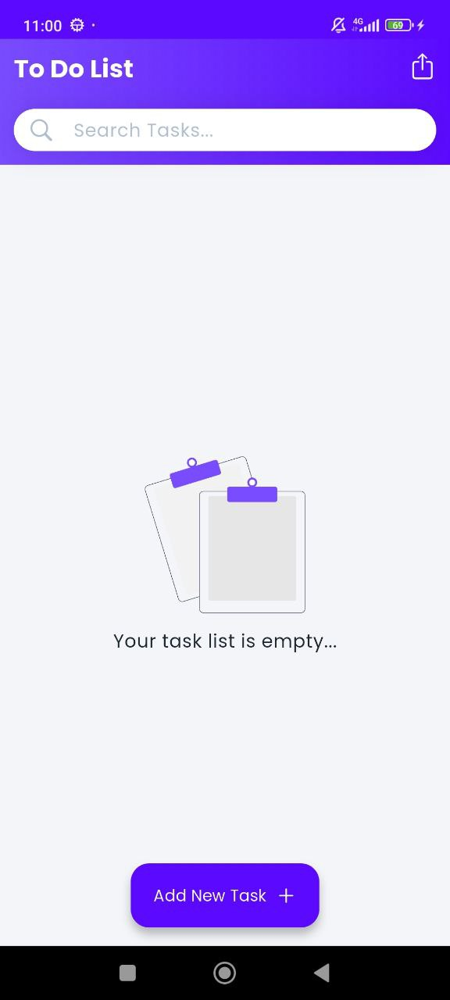
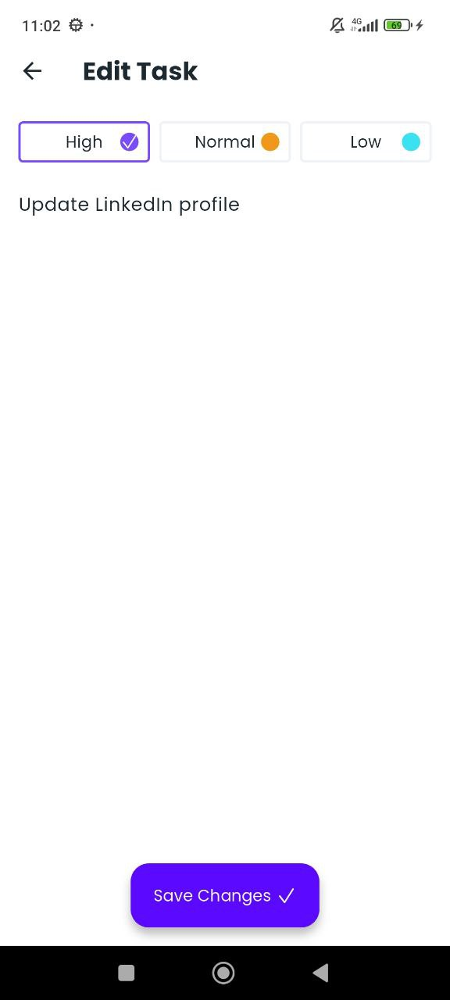
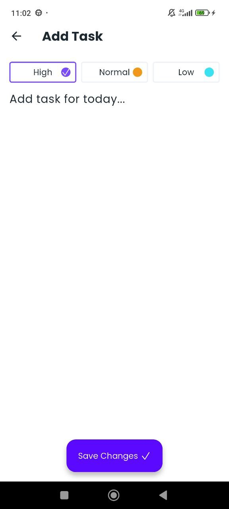

# 📝 Flutter Todo List

A beautiful and functional todo list application built with Flutter. This is the **third project** in my Flutter learning journey, focusing on state management, local data persistence, and modern UI design.

## 📱 Screenshots

<p align="center">
  
  
  
  
</p>

## ✨ Features

- ✅ **Create Tasks** - Add new tasks with custom names
- 🎨 **Priority Levels** - Assign priority (High, Normal, Low) with color coding
- ✏️ **Edit Tasks** - Modify existing tasks anytime
- ✓ **Mark Complete** - Check off completed tasks with visual feedback
- 🗑️ **Delete Tasks** - Remove individual tasks with long press or delete all at once
- 🔍 **Search Functionality** - Search through your tasks (tap outside to dismiss keyboard)
- 💾 **Local Storage** - Tasks persist using Hive database
- 🎭 **Empty State** - Beautiful SVG illustration when no tasks exist
- 🎯 **Modern UI** - Clean, intuitive interface with gradient headers
- 📱 **Responsive Design** - Works seamlessly across different screen sizes

## 🛠️ Technologies & Packages

- **Flutter SDK** - Cross-platform mobile development framework
- **Dart** - Programming language
- **Hive** - Lightweight and fast key-value database for local storage
- **Google Fonts** (Poppins) - Custom typography
- **flutter_svg** - SVG rendering support
- **Material Design 3** - Modern UI components

## 📦 Dependencies

```yaml
dependencies:
  flutter:
    sdk: flutter
  cupertino_icons: ^1.0.8
  hive_flutter: ^1.1.0
  google_fonts: ^6.1.0
  flutter_svg: ^2.2.2

dev_dependencies:
  flutter_test:
    sdk: flutter
  hive_generator: ^2.0.1
  build_runner: ^2.5.4
  flutter_lints: ^5.0.0
```

## 🚀 Getting Started

### Prerequisites

- Flutter SDK (3.7.0 or higher)
- Dart SDK
- Android Studio / VS Code with Flutter plugins
- An emulator or physical device

### Installation

1. **Clone the repository**

   ```bash
   git clone https://github.com/Ali-HajiAbdollahi/flutter_todo_list.git
   cd flutter_todo_list
   ```

2. **Install dependencies**

   ```bash
   flutter pub get
   ```

3. **Generate Hive adapters**

   ```bash
   flutter pub run build_runner build
   ```

4. **Run the app**

   ```bash
   flutter run
   ```

## 📂 Project Structure

```
lib/
├── main.dart           # Main app entry, home screen, and task list UI
├── edit.dart           # Edit/Create task screen
├── data.dart           # Hive data models (TaskData, Priority)
└── data.g.dart         # Generated Hive adapters

assets/
└── empty_state.svg     # Empty state illustration
```

## 🎨 Color Scheme

- **Primary Color**: `#794CFF` (Purple)
- **Primary Container**: `#5C0AFF` (Dark Purple)
- **High Priority**: `#794CFF` (Purple)
- **Normal Priority**: `#F09819` (Orange)
- **Low Priority**: `#3BE1F1` (Cyan)
- **Background**: `#F3F5F8` (Light Gray)

## 🎓 Learning Journey

This is my **third project** in learning Flutter development. Through this project, I've gained hands-on experience with:

1. **State Management** - Using StatefulWidget and setState for reactive UI
2. **Local Data Persistence** - Implementing Hive for NoSQL database storage
3. **Custom UI Components** - Building reusable widgets and custom designs
4. **Navigation** - Managing routes and passing data between screens
5. **Forms & Input** - Handling user input and validation
6. **Gestures** - Implementing tap, long-press, and focus management
7. **Asset Management** - Working with SVG images and custom fonts
8. **Code Generation** - Using build_runner for type-safe data models

## 🔧 How It Works

1. **Data Model**: Tasks are stored as Hive objects with properties: name, isCompleted, and priority
2. **Local Storage**: Hive database persists tasks locally on the device
3. **Real-time Updates**: ValueListenableBuilder listens to database changes and updates UI automatically
4. **Priority System**: Three priority levels with distinct colors for visual organization
5. **Empty State**: Shows a friendly SVG illustration when the task list is empty

## 📝 Key Features Implementation

- **Add Task**: Floating action button navigates to edit screen in create mode
- **Edit Task**: Tap on any task to modify it
- **Complete Task**: Tap checkbox to toggle completion status
- **Delete Task**: Long press on task or use "Delete All" button
- **Search**: Type in search field; tap outside to dismiss keyboard
- **Persistence**: All changes automatically saved to Hive database

## 🤝 Contributing

This is a learning project, but suggestions and feedback are always welcome! Feel free to:

- Report bugs
- Suggest new features
- Submit pull requests
- Share your improvements

## 📄 License

This project is open source and available for learning purposes.

## 👨‍💻 Author

**Ali Haji Abdollahi**

- GitHub: [@Ali-HajiAbdollahi](https://github.com/Ali-HajiAbdollahi)

## 🙏 Acknowledgments

- Flutter team for the amazing framework
- [undraw.co](https://undraw.co) for the empty state illustration
- Google Fonts for the Poppins font family
- The Flutter community for inspiration and support

---

⭐ If you found this project helpful in your Flutter learning journey, please give it a star!
